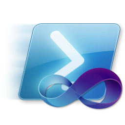

# Posh-VsVars

Powershell cmdlets to help import Visual Studios `vsvars32.bat` into the current
shell session for use with

## Compatibility

* This is written for Powershell v2 / v3
  * Powershell v3 can be installed with [Chocolatey][] via `cinst powershell`

[Chocolatey]: http://www.chocolatey.org

## Installation

### Chocolatey

Once Chocolatey has been installed, simply use the `cinst` command.

```powershell
cinst posh-vsvars
```

Chocolatey installation will both import the module into your PowerShell profile
AND run `Set-VsVars`.  If the default `latest` version behavior is undesirable,
then edit the `$PROFILE` file, find where `Posh-VsVars` is dot-sourced from,
and comment the line `Set-VsVars`

## Supported Commands

### Set-VsVars

Will find and load the `vsvars32.bat` file for the latest Visual Studio version
installed on the given system, and will extract the environment information
into the current shell session.

```powershell
Set-VsVars
```

The same as above, except will only look for Visual Studio 2012.

```powershell
Set-VsVars -Version '11.0'
```

Note a couple of useful points about this cmdlet:

- The `PROMPT` environment variable is excluded from being overwritten
- A global variable in the current session ensures that the same
environment variables haven't been loaded multiple times.
- `PATH` has duplicate entries removed in an effort to prevent it from
exceeding the length allowed by the shell (generally 2048 characters)

### Get-VsVars

Will find and load the `vsvars32.bat` file for the latest Visual Studio version
installed on the given system, extrapolating it's environment information into a Hash.

```powershell
Get-VsVars
```

The same as above, except will only look for Visual Studio 2012.

```powershell
Get-VsVars -Version '11.0'
```

## Credits

* Original concept is derived from Chris Tavares ([@gzortch][]) - [The last vsvars32 I'll ever need][]
* Icon is from Scott Hanselman ([@shanselman][]) - courtesy of his [blog posting][]

[@gzortch]: https://github.com/gzortch
[The last vsvars32 I'll ever need]: http://www.tavaresstudios.com/Blog/post/The-last-vsvars32ps1-Ill-ever-need.aspx
[@shanselman]: https://github.com/shanselman
[blog posting]: http://www.hanselman.com/blog/AwesomeVisualStudioCommandPromptAndPowerShellIconsWithOverlays.aspx

## Roadmap

None AFAIK.. this is feature complete.

